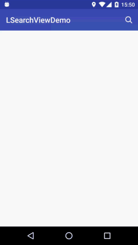

LSearchView
===========

This is an Android L design search view. It support reveal animation, let's review.

#Preview

##eg.1 HiQianBei
This is an Chinese local app, so you can't install it from google play.It just use for demo.
If you want to try it, you can download here: http://www.wandoujia.com/apps/com.superlity.hiqianbei


##eg.2 LSearchView
This is the LSearchView demo, you can see the source code in this the ```demo``` module.



#build.gradle
In your project root path ```build.gradle``` file, add this:

```groovy
allprojects {
	repositories {
		...
		maven { url "https://jitpack.io" }
	}
}
```

And in your module path ```build.gradle``` file, add this:

```groovy
dependencies {
        compile 'com.github.onlynight:LSearchView:1.0.0'
}
```

#Sample Code

layout file:

```xml
<com.github.onlynight.library.lsearchview.LSearchView
    android:id="@+id/searchView"
    android:layout_width="match_parent"
    android:layout_height="match_parent"
    android:padding="8dp"
    app:anim_origin_x="23dp"
    app:anim_origin_y="23dp"
    app:anim_time="500"
    app:back_btn_icon="@drawable/ic_back"
    app:search_bar_height="48dp"
    app:search_bg_color="#aa000000"
    app:search_btn_icon="@drawable/ic_search"
    app:search_hint="search something">

    <ListView
        android:id="@+id/listView"
        android:layout_width="match_parent"
        android:layout_height="wrap_content"
        android:layout_marginTop="4dp"
        android:background="@drawable/l_search_view_bg"/>

</com.github.onlynight.library.lsearchview.LSearchView>
```

controller java code:

```java
searchView = (LSearchView) findViewById(R.id.searchView);

searchView.getSearchButton().setOnClickListener(new View.OnClickListener() {
    @Override
    public void onClick(View view) {
        searchView.setSearching(true);
        searchView.postDelayed(new Runnable() {
            @Override
            public void run() {
                searchView.setSearching(false);
            }
        }, 1000);
    }
});
searchView.getBackButton().setOnClickListener(new View.OnClickListener() {
    @Override
    public void onClick(View view) {
        onBackSearch();
    }
});

private void onBackSearch(){
    searchView.hideWithAnim();
    adapter.clear();
    adapter.notifyDataSetChanged();
}
```

#XML property explain

```xml
<declare-styleable name="LSearchView">

    <!-- search bar height;
    the default is 48dp;-->
    <attr name="search_bar_height" format="dimension"/>

    <!-- back button padding;
    back button size = search_bar_height - search_button_padding*2;
    the default is 12dp;-->
    <attr name="back_button_padding" format="dimension"/>

    <!-- search button padding;
    search button size = search_bar_height - search_button_padding*2;
    the default is 12dp;-->
    <attr name="search_button_padding" format="dimension"/>

    <!-- edit text view hint text;
    no default;-->
    <attr name="search_hint" format="string"/>

    <!-- search view background color;
    the default is 0xaa000000;-->
    <attr name="search_bg_color" format="color"/>

    <!-- search view animation duration time;
    no default value;-->
    <attr name="anim_time" format="integer"/>

    <!-- search view reveal animation start x from right;
    the default is 23dp;-->
    <attr name="anim_origin_x" format="dimension"/>

    <!-- search view reveal animation start y from top;
    the default is 23dp-->
    <attr name="anim_origin_y" format="dimension"/>

    <!-- search bar back button icon res;
    the default is R.darwable.ic_back;-->
    <attr name="back_btn_icon" format="reference"/>

    <!-- search bar search button icon res;
    the default is R.darwable.ic_search;-->
    <attr name="search_btn_icon" format="reference"/>
</declare-styleable>
```

#API explain

```java
/**
 * Set the searching state and change search button to progress bar.
 * If you mean to use it, first when you start search you should call
 * setSearching(true), and when you end your search you should call
 * setSearching(false).
 * @param searching is the searching state
 * @return
 */
public void setSearching(boolean searching);

/**
 * You can get the back button use this method.
 * @return
 */
public LinearLayout getBackButton();

/**
 * You can get the search button use this method.
 * @return
 */
public LinearLayout getSearchButton();

/**
 * You can get the search edittext view use this method.
 * @return
 */
public EditText getSearchEdit();

/**
 * Call this method to show the view.
 * When initial the LSearchView it's invisible,
 * you must call this method to show it.
 */
public void showWithAnim();

/**
 * Call this mehod to hide the view with animation.
 */
public void hideWithAnim();
```

#THANKS

[nineoldandroids]

[CircularReveal]

#License

```
Copyright 2016 onlynight

Licensed under the Apache License, Version 2.0 (the "License");
you may not use this file except in compliance with the License.
You may obtain a copy of the License at

   http://www.apache.org/licenses/LICENSE-2.0

Unless required by applicable law or agreed to in writing, software
distributed under the License is distributed on an "AS IS" BASIS,
WITHOUT WARRANTIES OR CONDITIONS OF ANY KIND, either express or implied.
See the License for the specific language governing permissions and
limitations under the License.
```

[nineoldandroids]: https://github.com/JakeWharton/NineOldAndroids
[CircularReveal]: https://github.com/ozodrukh/CircularReveal
